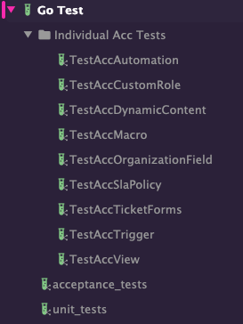
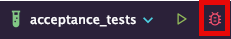
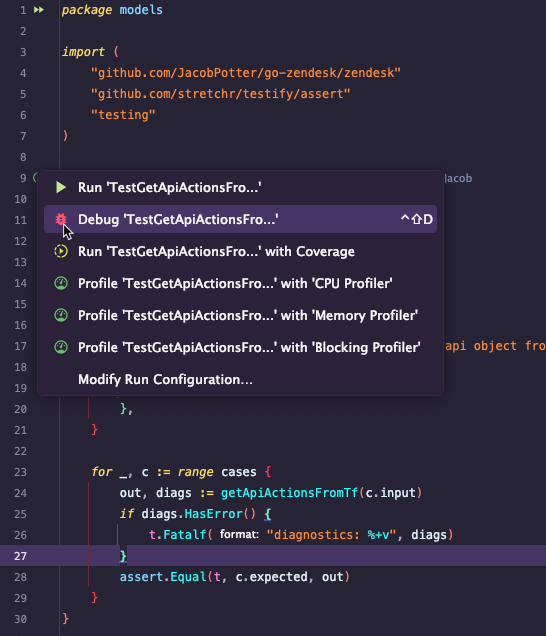

# Zendesk Terraform Provider

> [!IMPORTANT]  
> Read the contribution guideline before adding a pull request.

<!-- TOC -->
* [Zendesk Terraform Provider](#zendesk-terraform-provider)
  * [Developing the Provider](#developing-the-provider)
    * [Adding and Updating Dependencies](#adding-and-updating-dependencies)
    * [Documentation Generation](#documentation-generation)
    * [Testing](#testing)
      * [Acceptance Testing](#acceptance-testing)
      * [Jetbrains IDE](#jetbrains-ide)
      * [Visual Studio Code](#visual-studio-code)
      * [Command line](#command-line)
    * [Debugging](#debugging)
      * [Debugging Tests](#debugging-tests)
        * [Jetbrains Test Debugging](#jetbrains-test-debugging)
      * [Connect Terraform CLI to IDE Debugger](#connect-terraform-cli-to-ide-debugger)
        * [Jetbrains CLI Debugging](#jetbrains-cli-debugging)
      * [Visual Studio Code](#visual-studio-code-1)
      * [Command line](#command-line-1)
<!-- TOC -->

## Developing the Provider

If you wish to work on the provider, you'll first need [Go](http://www.golang.org) installed on your machine (
see [Requirements](#requirements) above).

To compile the provider, run `go install`. This will build the provider and put the provider binary in the `$GOPATH/bin`
directory.

### Adding and Updating Dependencies

This provider uses [Go modules](https://github.com/golang/go/wiki/Modules).
Please see the Go documentation for the most up to date information about using Go modules.

To add a new dependency `github.com/author/dependency` to your Terraform provider:

```shell
go get github.com/author/dependency
go mod tidy
```

To update an existing dependency:

```shell
go get -u github.com/author/dependency
go mod tidy
```

In either case, commit the changes to `go.mod` and `go.sum`.

### Documentation Generation

> [!IMPORTANT]
> This is required when making any schema changes, as the pipeline will fail if docs are not updated in PR
> To generate or update documentation, run `go generate`.

### Testing

#### Acceptance Testing

> [!CAUTION]
> In order to run acceptance tests, the following environment variables must be set:

| Name              | Description                                                                  |
|-------------------|------------------------------------------------------------------------------|
| TF_ACC            | Enables acceptance tests in TF plugin testing framework, set to value of `1` |
| ZENDESK_SUBDOMAIN | Zendesk subdomain, ex: dynatrace                                             |
| ZENDESK_USERNAME  | Zendesk username used for basic token auth.                                  |
| ZENDESK_API_TOKEN | API token used for Zendesk basic token auth.                                 |

#### Jetbrains IDE

All required testing commands are included as Jetbrains run configurations in `.idea` folder. They include the following
configs:



There are configs for unit testing, provider wide acceptance testing and acceptance testing for individual resources.

#### Visual Studio Code

> [!NOTE]
> TBD

#### Command line

To unit test, simply run `go test -v`

In order to run the full suite of Acceptance tests, run `go test -v` with the environment variables in
the [Acceptance Testing](#acceptance-testing) section

### Debugging

#### Debugging Tests

Both unit tests and acceptance tests can be debugged in an IDE for troubleshooting purposes

##### Jetbrains Test Debugging

Acceptance tests run configs can be debugged automatically by running `Debug` in IDE for particular run config (either
press `F5` or click on the debug icon like below).



Debugging Unit tests is as simple as going to the test file, and running the `Debug` command from there:



#### Connect Terraform CLI to IDE Debugger

With Terraform, it is possible to compile a version of the provider locally, then start a debugger service that the
Terraform CLI can be pointed to instead of the provider registry. This allows a developer to run a Terraform CLI cmd 
such as `terraform plan` or `terraform apply` and debug live in their IDE for advanced troubleshooting scenarios. 

##### Jetbrains CLI Debugging

> [!NOTE]
> TBD

#### Visual Studio Code

> [!NOTE]
> TBD

#### Command line

